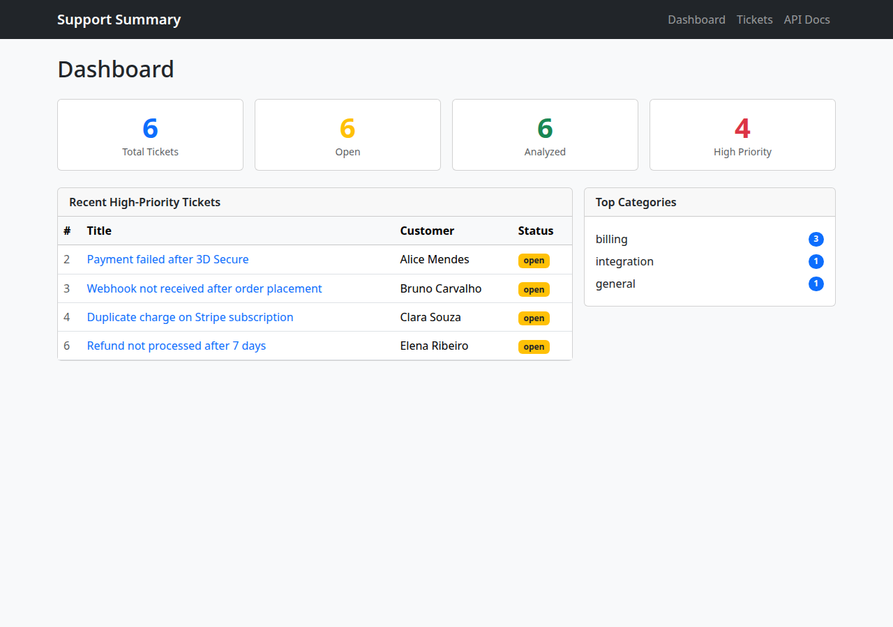
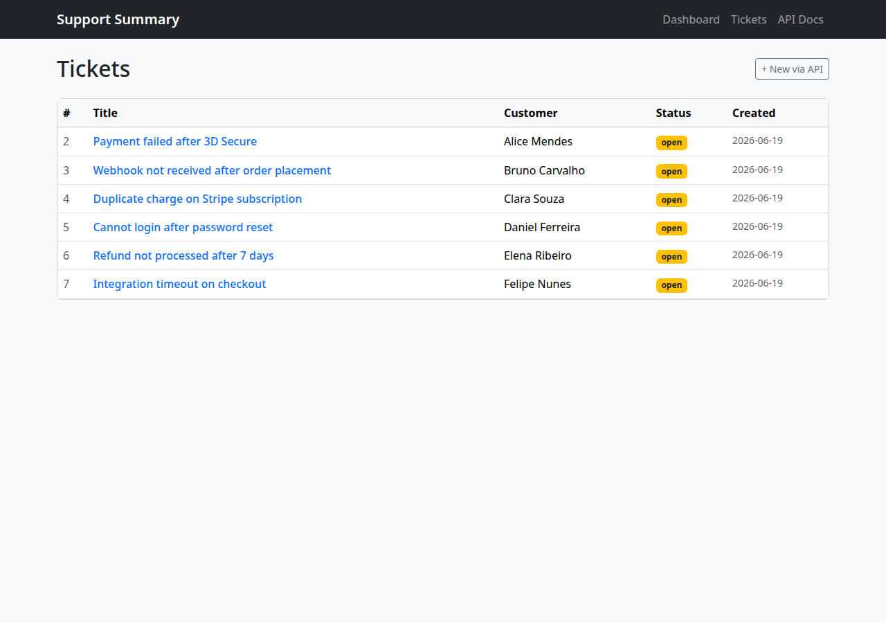
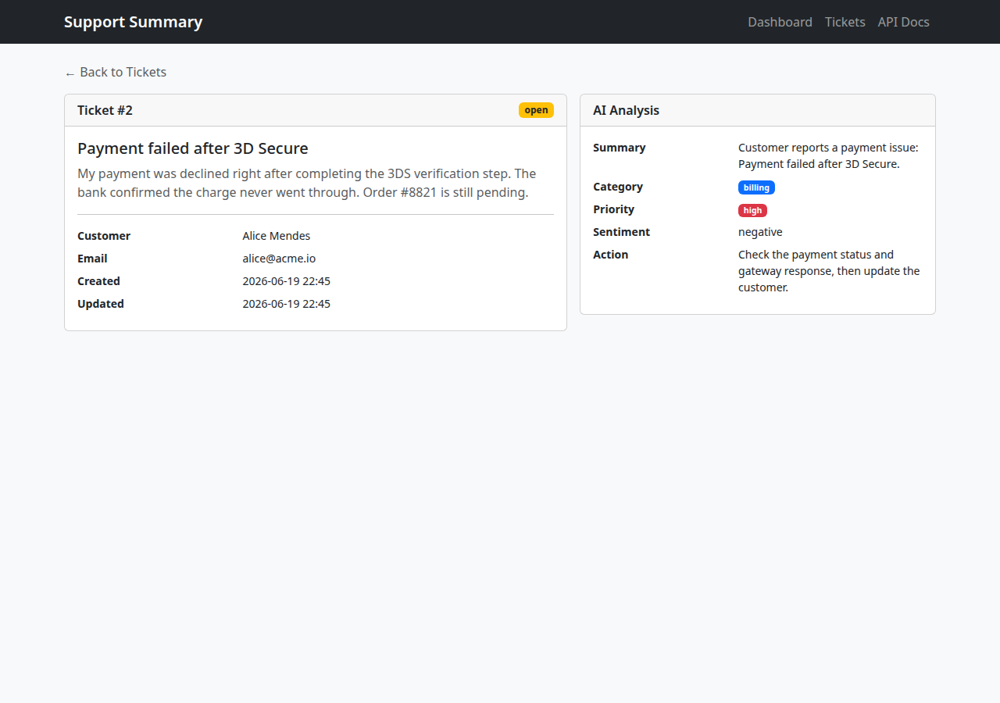

# AI Support Summary API

[](https://github.com/felicianopj-dev/ai-support-summary-api/actions/workflows/ci.yml)
[](https://codecov.io/gh/felicianopj-dev/ai-support-summary-api)
[](LICENSE)

A FastAPI backend that simulates a customer support system where tickets are analyzed by an AI service and stored in a relational database. Built as a portfolio project to demonstrate production-style Python backend patterns.

## Why this project

This project covers the full backend lifecycle of a real-world feature:

- Designing a REST API with FastAPI and Pydantic v2
- Persisting relational data with SQLAlchemy 2 (mapped columns, relationships, cascade deletes)
- Managing schema evolution with Alembic migrations
- Implementing a **mock-first, real-AI-later** design — the system works without any API keys, and real Gemini integration is enabled via a single environment variable
- Serving server-rendered HTML pages (Jinja2 + Bootstrap) alongside a JSON API in the same app
- Writing integration tests with in-memory SQLite and no mocks

## Features

- Ticket CRUD — create, list, get, and update ticket status
- AI analysis per ticket: summary, category, priority, sentiment, and recommended action
- Deterministic mock AI based on keyword rules — no external dependencies required
- Optional Google Gemini integration (`gemini-2.0-flash`) activated via `GEMINI_API_KEY` — free tier available
- Aggregate insights endpoint (`/api/insights`) with ticket counts and top categories
- Server-rendered dashboard, ticket list, and detail pages
- Seed script with 6 realistic demo tickets (`scripts/seed.py`)
- 20 automated tests using in-memory SQLite — no database connection needed to run tests
- Continuous integration (GitHub Actions) running Ruff lint + format, strict Mypy, and the test suite
- Alembic migrations with a dated naming convention (`YYYYMMDD_NNNN_description`)

## Tech stack

| Layer | Technology |
|-------|-----------|
| API framework | FastAPI 0.115 |
| ORM | SQLAlchemy 2.0 |
| Migrations | Alembic 1.14 |
| Database | PostgreSQL 16 |
| DB driver | psycopg 3 |
| Server | Uvicorn |
| Templates | Jinja2 + Bootstrap 5 (CDN) |
| AI (optional) | Google Gemini (`gemini-2.0-flash`) |
| Tests | Pytest + HTTPX |
| Containers | Docker Compose |

## Architecture

Requests flow through `app/routers/` (FastAPI route handlers) into `app/services/` (AI analysis logic) and `app/models/` (SQLAlchemy ORM). `app/schemas/` defines Pydantic types for request validation and response serialization. HTML pages (`app/routers/pages.py`) and the JSON API share the same database session and models — there is no internal HTTP layer between them.

The AI service (`app/services/`) checks for `GEMINI_API_KEY` at call time. If present, it calls Gemini; otherwise it falls back to the deterministic mock. Tests always use the mock because no key is set in the test environment.

```
app/
├── routers/        # HTTP handlers (tickets, insights, pages)
├── services/       # AI analysis (mock_ai.py + gemini_ai.py)
├── models/         # SQLAlchemy ORM models (Ticket, TicketAnalysis)
├── schemas/        # Pydantic request/response types
└── templates/      # Jinja2 HTML templates
```

## Screenshots

**Dashboard**


**Ticket list**


**Ticket detail with AI analysis**


## Quick start

Requirements: Docker with Compose support.

```bash
git clone https://github.com/felicianopj-dev/ai-support-summary-api.git
cd ai-support-summary-api
docker compose up --build
```

Seed the database with demo tickets:

```bash
docker compose exec api python scripts/seed.py
```

| URL | Description |
|-----|-------------|
| <http://localhost:8000/> | Dashboard |
| <http://localhost:8000/tickets> | Ticket list |
| <http://localhost:8000/docs> | OpenAPI docs |
| <http://localhost:8000/health> | Health check |

Stop and remove containers:

```bash
docker compose down        # keep data volume
docker compose down -v     # also remove PostgreSQL data
```

## API examples

```bash
# Create a ticket
curl -X POST http://localhost:8000/api/tickets \
  -H "Content-Type: application/json" \
  -d '{
    "customer_name": "Ada Lovelace",
    "customer_email": "ada@example.com",
    "title": "Payment failed after 3D Secure",
    "description": "My payment was declined right after the 3DS step."
  }'

# List all tickets
curl http://localhost:8000/api/tickets

# Analyze a ticket with AI
curl -X POST http://localhost:8000/api/tickets/1/analyze

# Aggregate insights
curl http://localhost:8000/api/insights
```

## Gemini integration

By default the mock AI service is used. To switch to real Gemini analysis (free tier — no credit card required):

```bash
# Install the optional dependency
pip install -e ".[ai]"

# Get a free key at https://aistudio.google.com/apikey
# Then set it (or add it to .env)
export GEMINI_API_KEY=...
```

When `GEMINI_API_KEY` is set, `POST /api/tickets/{id}/analyze` calls `gemini-2.0-flash` and returns a real AI-generated analysis. Tests are unaffected — they always run in mock mode.

Under Docker Compose the key is passed through from your host shell or a local `.env` file (Compose auto-loads it), so `GEMINI_API_KEY=... docker compose up` — or putting the key in `.env` — enables the live path inside the container. The image installs the `ai` extra, so the Gemini SDK is already present.

## Run locally

Requirements: Python 3.12 and a running PostgreSQL instance.

```bash
python3.12 -m venv .venv
source .venv/bin/activate
pip install -e ".[dev]"
cp .env.example .env
set -a && source .env && set +a
alembic upgrade head
uvicorn app.main:app --reload
```

Seed demo data:

```bash
python scripts/seed.py
python scripts/seed.py --force   # clear and reseed
```

## Tests

Tests use an in-memory SQLite database and do not require a running PostgreSQL instance.

```bash
pytest            # run all 20 tests
pytest -v         # verbose output
pytest -k analyze # run tests matching a keyword
```

## Code quality

Linting, formatting, type checking, and a 90% coverage gate match what CI enforces on every push:

```bash
ruff check .          # lint
ruff format --check . # formatting
mypy app              # strict static type checking
pytest --cov=app      # tests with coverage report
```

A `Makefile` wraps the common tasks (`make check` runs lint + typecheck + tests), and
[pre-commit](https://pre-commit.com) hooks (ruff + mypy) run the same checks before each commit:

```bash
make install   # editable install + pre-commit hooks
make check     # everything CI enforces
```

## Database migrations

After adding or changing a SQLAlchemy model:

```bash
alembic revision --autogenerate -m "describe change"
alembic upgrade head
```

Migration files follow the naming convention `YYYYMMDD_NNNN_description.py` and live in `migrations/versions/`.
